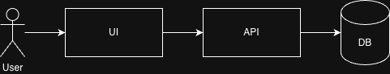
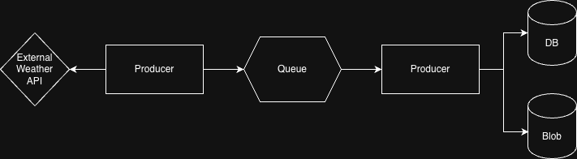

# 002 Project initial architecture

This Architecture Decision Log (ADL) includes initial architecture of the system.

We don't discuss any technologies here since we are just trying to build out the building blocks of the application.

## General service structure

The application will initially have the following components structure.

- [Weather Producer](#weather-producer) - fetches external API and produces to message queue.
- [Weather Consumer](#weather-consumer) - consumes messages from queue and sinks with data sinks. These include blob storage and database.
- [Weather UI](#weather-ui) - renders weather from the database.
- [Weather Application API](#weather-api) - reads and serves saved weather from database. This will be used by the UI.

As you can see, this architecture includes [Command Query Responsibility Segregation](https://en.wikipedia.org/wiki/Command_Query_Responsibility_Segregation), separating the read and write paths. This is to decouple both the Weather Application API from the Weather Consumer. This adds complexity but is decided for the sake of learning.

All of the services will need to be suitably highly available and recover from server failure. Monitoring of the system should be centralized and accessible only by the maintainer of the system.

These services need to be secure and this will be discussed in more detail in [Security Considerations](#security-considerations) below.

Each service's responsibility is defined below

## [Weather Producer]

The following decisions have been made about the Weather Producer:

- As highlighted in [Project Initial Assumptions - Assumption 1](./001-project-initial-assumptions.md#assumption-1), the current requirements rely on fetching weather updates every 30 minutes. Hence, a [Kubernetes Cronjob](https://kubernetes.io/docs/concepts/workloads/controllers/cron-jobs/) is deemed suitable. This will run on a scheduled that is inline with the rate limiting of the external weather api we are using.

- In order to reduce Weather Producer's connection to critical services and data sinks, and reducing the attack surface, Weather Producer will only have access to writing to a message queue. The [Weather Consumer](#weather-consumer), described below, will be in chart of the saving of the data to our data sinks.

Combining both of these, we have the following pseudocode for the Weather Producer job:

```pseudocode
fn produce() {
    weather = queryApi()
    produceMsg(queue, weather)
}
```

## [Weather Consumer]

The following decisions have been made about the Weather Consumer:

- As highlighted in [Project Initial Assumptions - Assumption 4](./001-project-initial-assumptions.md#assumption-4), data needs to be stored in both blob storage and the database for analytical/application workloads respectively.

We have the following pseudocode for the Weather Producer job:

```pseudocode
fn consume() {
    while getFromQueue(queue) {
        rawWeatherMsg = consumeMsg(queue)

        sinkBlobStorage(rawWeatherMsg)

        // sanitize
        sanitizedWeather = sanitizeWeather(rawWeatherMsg)
        sinkDatabase(sanitizedWeather)
    }
}
```

## [Weather UI]

With the data being stored in our system, we will initially have the following user journeys:

- User can search from list of locations for the latest weather.
- User can see a graph of historical data (up to 3 months in the past).

Details of the UX will be described in a subsequent ADL.

## [Weather API]

Given the above user journeys, the following APIs will be implemented:

- GET /api/weather?location=London&location=Paris&location=Tokyo

This will return the weather at given locations.

- GET /api/weather/historical/<location>

We will only allow querying for historical data for a specific location to reduce large data transmission.

Details on the response of the API will be described in a subsequent ADL.

## Security considerations

As this will be a public application available on the internet, we will need to ensure the system is secure and reduce the attack blast radius.

Since the producer/consumer data happens in the background, only the [Weather Application API](#weather-api) needs to be exposed to the internet.

As described in [Project Initial Assumptions - Assumption 2](./001-project-initial-assumptions.md#assumption-2), rate limiting and authz will be put in place to reduce any users from accessing the platform.

All instances will communicate with each other securely using [mTLS](https://en.wikipedia.org/wiki/Mutual_authentication). This will further reduce the blast radius were the system to be partially compromised.

The overall architecture is described below:

### Read-pattern



### Write-pattern


